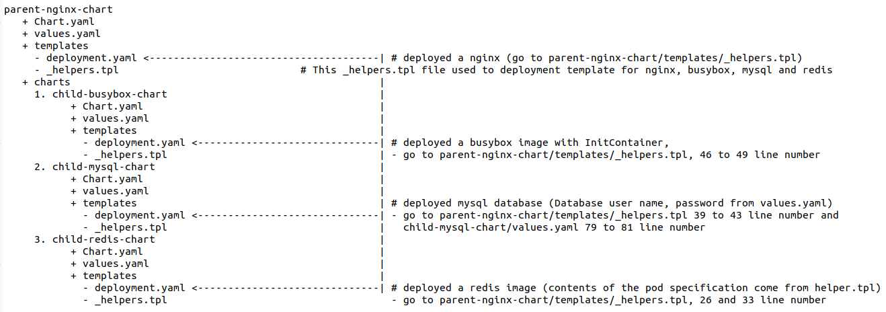

# Deploying Four Microservices Using One Helm Template

# Goal 

1) Create deployment of ngnix using helm
2) Deploy a busybox image with init contain
3) Deploy a redis image using helm (contents of the pod specification should be come from helper file)
4) Deploy mysql database using Helm (Database user name , password from values.yaml)
5) Deploy all the above using 1 single helm chart (using umbrella chart)

# Chart Image

# Deploy all the above using 1 single helm chart (using umbrella chart) 

/home/parent-nginx-chart
RUN : helm install --dry-run --debug complex-chart .
RUN : helm install complex-chart .
